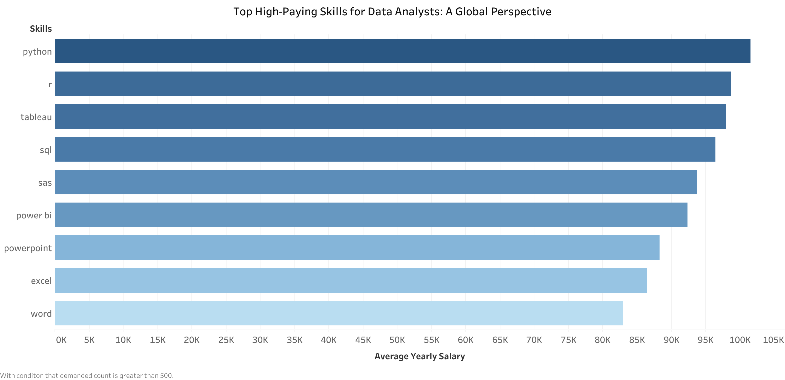
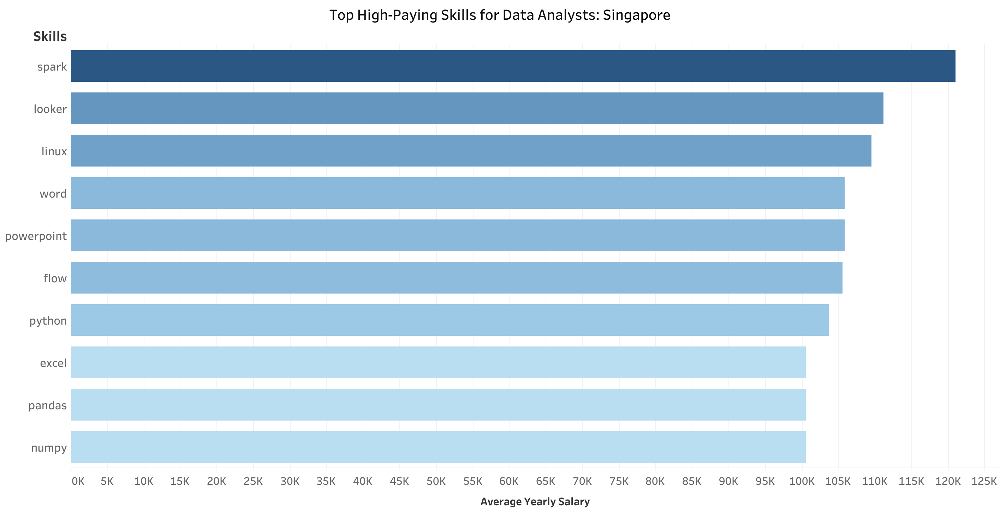

# What Should You Learn to Become a Data Analyst in Singapore🇸🇬?

## Introduction

This project analyzes job postings for data-related roles in Singapore as of 2023. It identifies the key skills required for data analysts and examines the correlation between these in-demand skills and their average yearly income. Whether you're starting your career or looking to upskill, this analysis will help you understand the current job market and make informed decisions about your professional development.

Check the sql queries made it this analysis : [**SQL Queries**](/project_sql/)

## Table of Contents 📖

1. [Background](#background)
   1. [What questions this analysis address?](#what-question-this-analysis-address?)
   2. [Data Source](#data-source-)
   3. [Main Tools Use](#main-tools-used)
   4. [Points to note](#points-to-note)
2. [Analysis](#analysis)
3. [Conclusion](#conclusion)
4. [Appendix](#appendix)

## Background

### What questions does this project answer?

* What are the most in-demand skills for a data analyst in Singapore?
* Do highly demanded skills correlate with high-paying jobs?

### Data Source 📓

[*Data Set*](https://huggingface.co/datasets/lukebarousse/data_jobs/tree/main) created by Luke Barousse from 🤗 Hugging Face.

### Main Tools Used

* PostgreSQL
* Tabelau

### Points to Note

The job postings from Singapore that have salaries listed in the data set are very limited (only 27 observations). Apart from this, the data set has been checked to be clean and fair by me, so no additional data cleaning process is implemented. The data limitation will be addressed in the analysis by referencing the overall data as a proxy.

All data on salary is in US dollars.

## Analysis

### Demanded Skills for Data Analyst in Singapore

1.	SQL is the most critical skill, essential for data querying and manipulation.
2.	Python is highly valued for its versatility in data analysis and machine learning.
3.	Excel remains important, showing the need for traditional data handling tools.
4.	Tableau and Power BI are key for data visualization, reflecting a demand for presenting data   insights.
5.	R is sought after for statistical analysis.
6.	SAS and AWS skills are needed for advanced analytics and cloud computing.
7.	PowerPoint and Word highlight the necessity for effective communication and documentation of data insights.

These insights indicate a balanced demand for both traditional and modern data analysis tools.

### Demanded VS High Paying

In this section, I will dive into the data to further analyze whether high-demand skills equate to high-paying skills. As mentioned in the Points to Note, since the data for data analysts with listed salaries is very limited, I will look into global data for this part.

### &#8203

The above tables show that the in-demand skills for data analysts in Singapore are quite similar to those in the world. This proves that I have a solid ground to use global data to provide insights on the situation in Singapore.

### High Paying Skills

The chart highlights the top high-paying skills for data analysts, focusing on big data expertise. The analysis excludes outliers by considering only skills with a demand count greater than 100.

Top Five High-Paying Big Data Skills:

1.	Spark: Commands the highest salaries, indicating its critical role in big data processing.
2.	Databricks: Close second, reflecting its importance in managing and analyzing large datasets.
3.	Snowflake: High demand for this data warehousing tool translates to lucrative pay.
4.	Hadoop: Essential for big data storage and processing, offering competitive salaries.
5.	NoSQL: Valued for handling unstructured data, leading to high compensation.

Insight:

These high-paying skills are likely required for more senior data analyst roles or for specialized needs within organizations. Mastery of these tools is essential for managing and analyzing large datasets, making them highly valuable in the industry.

#### Optimal Skills

To obtain a more general view on the pay for skills and insights for junior analysts, a condition that the demand count for each skill is greater than 500 is set.

The chart indicates that Python, R, and Tableau are the top three high-paying skills for data analysts globally. Other valuable skills include SQL, SAS, Power BI, PowerPoint, Excel, and Word.

## Conclusion

The [ranking of high-demand skills](#8203) and the [ranking of high-paying skills](#optimal-skills) are quite similar, indicating a high correlation between high demand and high pay.

The top five optimal skills for data analysts are:
1. Python
2. R
3. Tableau
4. SQL
5. SAS

Moreover, if you want to be a data analyst in Singapore, mastering:
1. Excel
2. Power BI
will be an advantage. Apart from the top five optimal skills, these are also among the top 10 high-demand skills in Singapore, especially Excel (ranked 3).

## Appendix

### (1)

Even though the data is limited, it is provided for reference.

### (2) [Click](https://public.tableau.com/views/required_skills_for_data_analyst/top_10_sg?:language=en-US&:sid=&:redirect=auth&:display_count=n&:origin=viz_share_link) to see my Viz for this project in tableau public